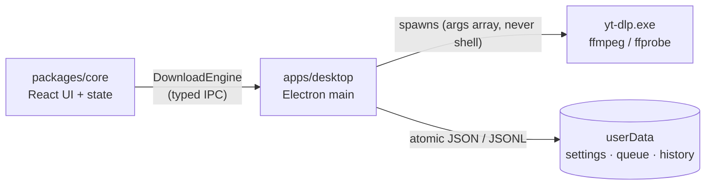

[](https://github.com/Myung-Young/FluxDL/releases)
[](https://github.com/Myung-Young/FluxDL/releases)
[](https://github.com/yt-dlp/yt-dlp)
[](https://pnpm.io)

**FluxDL** is a premium dark-UI desktop app for downloading video and audio —
a friendly face over the [yt-dlp](https://github.com/yt-dlp/yt-dlp) CLI, with
queueing, playlists, batch paste, live streams, and everything stored locally.
No accounts, no telemetry, no remote content: your links never leave your PC
except to fetch the media itself.

> You are responsible for respecting copyright and each site's terms.
> Only download content you own or are allowed to keep.

## Download

Grab the latest release for Windows 10/11 x64 (no admin needed):

- **`FluxDL-Setup-*.exe`** — per-user installer wizard, changeable install dir
- **`FluxDL-Portable-*.exe`** — single file, runs from any folder

No yt-dlp/ffmpeg install needed — both ship inside, verified by SHA-256.

> **Windows SmartScreen warning.** These builds are not code-signed, so
> SmartScreen shows *"Windows protected your PC"*. That is not a malware
> verdict — click **More info → Run anyway**.
> See [`docs/SIGNING.md`](docs/SIGNING.md) for signing options and SHA-256
> verification.

## Features

| Area | What you get |
| ---- | ------------ |
| 📥 Downloading | Single links, playlists with entry picker, batch paste (500 links), duplicate guard + download archive, pause/resume/cancel, concurrency 1–5, speed limiter with quick-throttle presets |
| 🎞️ Formats | Compatible MP4 (H.264+AAC), 480p–4K caps, best-quality audio (MP3/M4A/Opus/FLAC at top VBR), manual + auto-generated subtitles, SponsorBlock removal, chapters split, audio tag editor |
| 📡 Live | Detect live / upcoming / recorded streams, record-from-start, wait-for-scheduled-start |
| 🖥️ Desktop | System tray with live tooltip + taskbar progress, single-instance, `fluxdl://` links + CLI URLs, deep-link from a second launch, graceful shutdown (`.part` files resume), close-to-tray or quit, minimize-to-tray |
| 🔍 Library | Search, missing-file health check with relocate, in-app audio/video preview, re-download, Recycle-Bin delete |
| 📊 Insight | Live bandwidth sparkline, whole-queue ETA, per-day stats, raw engine logs with triage, one-click diagnostics report |
| ⌨️ Speed | Command palette (`Ctrl+K`), `Ctrl+1…6` view jumps, drag-and-drop links anywhere, clipboard watcher, multi-link paste auto-routes to Batch |
| 🎨 Feel | Four themes (incl. light + High-Contrast support), accent picker, comfortable/compact density, mini always-on-top window, English + Bahasa Melayu |

### Keyboard shortcuts

| Keys | Action |
| ---- | ------ |
| `Ctrl+V` | Paste link & analyze (multi-link → Batch) |
| `Ctrl+K` | Command palette |
| `Ctrl+,` | Settings |
| `Ctrl+1…6` | Home / Downloads / Library / Stats / Settings / Logs |
| `Ctrl+Shift+M` | Mini mode |
| `?` | Shortcut list |

### Send links from your browser

Register once (automatic on install), then use links like
`fluxdl://https%3A%2F%2Fyoutu.be%2F…` — or run `FluxDL.exe <url>` — and the
running app picks the video up, even from a second launch.

## Develop

Requirements: Node 20+, pnpm 10+. Windows 10/11 x64 for packaging (dev
tooling is cross-platform, but binaries and installers target win64).

```sh
pnpm install        # all workspaces
pnpm dev            # desktop dev window (electron-vite)
pnpm typecheck      # tsc, all workspaces
pnpm lint           # eslint, zero warnings
pnpm test           # vitest unit + integration (integration skips without a PATH yt-dlp)
pnpm build          # production bundles (out/)
```

Desktop extras:

```sh
pnpm --filter @grabber/desktop test:e2e   # Playwright smoke (needs pnpm build first)
pnpm fetch:binaries  # yt-dlp 2026.08.19 + ffmpeg win64-gpl into apps/desktop/resources/bin
pnpm make:icon       # regenerate tray PNG + app ICO (deterministic, no deps)
```

## Release

```sh
pnpm fetch:binaries  # once per clean checkout (gitignored output)
pnpm build
pnpm dist            # NSIS + portable into /release (also gitignored)
```

First run copies `yt-dlp.exe` into userData so self-update (`-U`) works under
Program Files; `ffmpeg`/`ffprobe` resolve from the bundled copy with a PATH
fallback. Packaged `appId` (`app.fluxdl.desktop`) doubles as the Windows
toast `appUserModelId`.

## Architecture



- `packages/core/src/branding.ts` — `APP_NAME`, the one display-name constant
- `packages/core/src/types.ts` — `MediaInfo`, `FormatOption`, `DownloadJob`, `AppSettings`, presets
- `packages/core/src/engine.ts` — `DownloadEngine` interface + `IPC_CHANNELS` single channel map
- `apps/desktop/src/main/` — window, CSP, tray/taskbar, single-instance, protocol, `media://` previews, IPC handlers
- `apps/desktop/src/preload/` — typed `window.grabber` bridge only
- `scripts/fetch-binaries.mjs` — SHA-256-verified yt-dlp + ffmpeg at build time (never committed)

Rules that keep this codebase healthy: TypeScript strict with no `any`,
zero Electron/Node imports in core (eslint-enforced), every URL validated
before it reaches the engine, `yt-dlp` flags verified against the real
binary, and `typecheck + lint + test + build` green after every milestone.

Further reading: `AGENTS.md` (working rules), `CLAUDE.md` (conventions),
`DECISIONS.md` (why things are the way they are), `CHANGELOG.md` (release
notes), [`docs/SIGNING.md`](docs/SIGNING.md) (code signing + SmartScreen).

## Contributing

Issues and pull requests are welcome. Conventional commits (`feat:`,
`fix:`, `chore:`, `docs:`, `test:` …), surgical diffs, and please keep the
four gates green before pushing.
