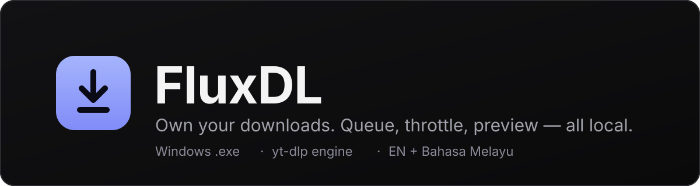
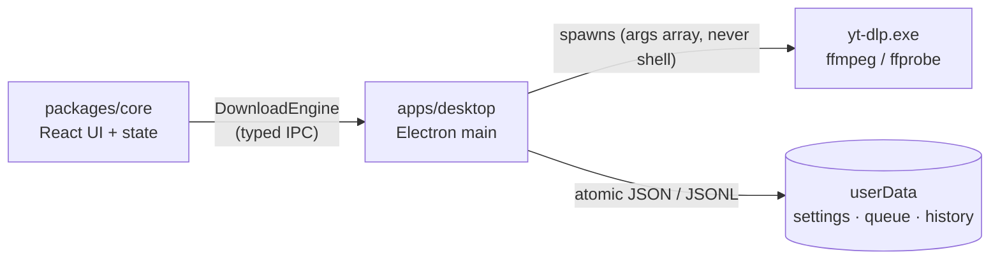

[](https://github.com/Myung-Young/FluxDL/releases)
[](https://github.com/Myung-Young/FluxDL/releases)
[](https://github.com/yt-dlp/yt-dlp)
[](https://pnpm.io)
[](https://github.com/Myung-Young/FluxDL)

**FluxDL** is a fast, private desktop downloader for video and audio on
Windows — a friendly face over the battle-tested
[yt-dlp](https://github.com/yt-dlp/yt-dlp) CLI, with queueing, playlists,
batch paste, live streams, and a compact always-on-top mini window.

- 🔒 **Local-first** — no accounts, no telemetry, no remote content. Your
  links never leave your PC except to fetch the media itself.
- 📦 **Zero setup** — yt-dlp + ffmpeg ship inside, SHA-256 verified.
  No admin rights needed.
- 🌍 **English + Bahasa Melayu** — full UI in both languages.

> You are responsible for respecting copyright and each site's terms.
> Only download content you own or are allowed to keep.

## Download

Get the latest release for **Windows 10/11 x64** from the
[Releases page](https://github.com/Myung-Young/FluxDL/releases):

| File                        | Best for                                                          |
| --------------------------- | ----------------------------------------------------------------- |
| **`FluxDL-Setup-*.exe`**    | Most users — per-user installer wizard, changeable install folder |
| **`FluxDL-Portable-*.exe`** | USB sticks & no-install use — single file, runs from any folder   |

> **"Windows protected your PC"?** These builds are not code-signed, so
> SmartScreen shows a warning on first run. That is an identity check,
> not a malware verdict — click **More info → Run anyway**.
> Details in [`docs/SIGNING.md`](docs/SIGNING.md).

## Quick start

1. **Paste a link** on the Home tab (`Ctrl+V` works anywhere) and hit
   **Analyze** — or press **Quick download** to skip the preview.
2. Pick a preset (**Compatible MP4**, 1080p, 4K, MP3…) and hit Download.
3. Track everything in **Downloads**, rewatch from the **Library**, and
   inspect any failure in **Logs** with one click.

Pasting **multiple links**? They route to the **Batch** tab automatically
(up to 500 links, playlists expandable per video).

## Features

| Area               | What you get                                                                                                                                                                   |
| ------------------ | ------------------------------------------------------------------------------------------------------------------------------------------------------------------------------ |
| 📥 Downloading     | Single links, playlists with entry picker, batch paste, duplicate guard + download archive, pause / resume / cancel / retry, concurrency 1–5, speed limiter with quick presets |
| 🎞️ Formats         | Compatible MP4 (H.264 + AAC), 480p–4K caps, top-quality audio (MP3 / M4A / Opus / FLAC), manual + auto subtitles, SponsorBlock removal, chapter splitting, audio tag editor    |
| 📡 Live & upcoming | Stream status detection, record-from-start, wait-for-scheduled-start                                                                                                           |
| 🪟 Mini window     | Always-on-top compact view with overall progress, per-download pause / resume / cancel, failed retry-all — toggle from the titlebar, `Ctrl+Shift+M`, palette, or tray          |
| 🖥️ Desktop         | Tray with live tooltip, taskbar progress, single-instance, `fluxdl://` links + CLI URLs, quit-confirmation when downloads run, graceful shutdown (`.part` files resume)        |
| 🍪 Logins & blocks | Browser-cookie import (Chrome / Edge / Firefox / …) or `cookies.txt`, clear bot-verification guidance, actionable error cards (retry, update engine, repair)                   |
| 📚 Library         | Search, missing-file health check with relocate, in-app audio/video preview, re-download, Recycle-Bin delete                                                                   |
| 📊 Insight         | Bandwidth sparkline, whole-queue ETA, history stats, raw engine logs with search, one-click diagnostics report                                                                 |
| ⌨️ Speed           | Command palette (`Ctrl+K`), view jumps, drag-and-drop links, clipboard watcher                                                                                                 |
| 🎨 Feel            | Four themes (dark + light + High Contrast), accent picker, comfortable/compact density                                                                                         |

### Keyboard shortcuts

| Keys           | Action                                    |
| -------------- | ----------------------------------------- |
| `Ctrl+V`       | Paste link & analyze (multi-link → Batch) |
| `Ctrl+K`       | Command palette                           |
| `Ctrl+,`       | Settings                                  |
| `Ctrl+1…6`     | Jump between views                        |
| `Ctrl+Shift+M` | Mini mode                                 |
| `?`            | Shortcut list                             |

### Send links from your browser

Register once (automatic on install), then open links like
`fluxdl://https%3A%2F%2Fyoutu.be%2F…` — or run `FluxDL.exe <url>` — and
the running app picks the video up, even from a second launch.

## Troubleshooting

**Windows Defender flags the download?**
Packaged `yt-dlp` binaries trip heuristic scanners on occasion. Verify the
SHA-256 published on the Releases page; if it matches, it is a false
positive — allow the file and report it to Microsoft to help everyone.

**"Sign in to confirm you're not a bot"?**
YouTube rate-limits datacenter IPs and unknown clients. Fixes, in order:

1. **Settings → Cookies from browser** (e.g. `chrome`) and retry.
2. **Logs → Check for update** to refresh the yt-dlp engine.
3. As a last resort, export a `cookies.txt` from your browser and point
   Settings at it. FluxDL walks you through each step on the error card.

**Download stalls or fails?**
Open **Logs**, pick the job, and read the raw engine output (search +
errors-only filter included). The **Copy diagnostics** button bundles
versions, redacted settings, and recent errors for a bug report.

**Something else?**
Check [`CHANGELOG.md`](CHANGELOG.md) for known limitations, then open an
issue with the diagnostics report attached.

## Develop

Requirements: Node 20+, pnpm 10+. Windows 10/11 x64 for packaging (dev
tooling is cross-platform, but binaries and installers target win64).

```sh
pnpm install        # all workspaces
pnpm dev            # desktop dev window (electron-vite)
pnpm typecheck      # tsc, all workspaces
pnpm lint           # eslint, zero warnings
pnpm test           # vitest unit + integration (integration skips without a PATH yt-dlp)
pnpm build          # production bundles (out/)
```

Desktop extras:

```sh
pnpm --filter @grabber/desktop test:e2e   # Playwright smoke (needs pnpm build first)
pnpm fetch:binaries  # yt-dlp + ffmpeg win64-gpl into apps/desktop/resources/bin
pnpm make:icon       # regenerate tray PNG + app ICO (deterministic, no deps)
```

## Release

```sh
pnpm fetch:binaries  # once per clean checkout (gitignored output)
pnpm build
pnpm dist            # NSIS + portable into /release (also gitignored)
```

First run copies `yt-dlp.exe` into userData so self-update (`-U`) works under
Program Files; `ffmpeg`/`ffprobe` resolve from the bundled copy with a PATH
fallback. Packaged `appId` (`app.fluxdl.desktop`) doubles as the Windows
toast `appUserModelId`.

## Architecture



- `packages/core/src/branding.ts` — `APP_NAME`, the one display-name constant
- `packages/core/src/types.ts` — `MediaInfo`, `FormatOption`, `DownloadJob`, `AppSettings`, presets
- `packages/core/src/engine.ts` — `DownloadEngine` interface + `IPC_CHANNELS` single channel map
- `apps/desktop/src/main/` — window, CSP, tray/taskbar, single-instance, protocol, `media://` previews, IPC handlers
- `apps/desktop/src/preload/` — typed `window.grabber` bridge only
- `scripts/fetch-binaries.mjs` — SHA-256-verified yt-dlp + ffmpeg at build time (never committed)

Rules that keep this codebase healthy: TypeScript strict with no `any`,
zero Electron/Node imports in core (eslint-enforced), every URL validated
before it reaches the engine, `yt-dlp` flags verified against the real
binary, and `typecheck + lint + test + build` green after every milestone.

Further reading: `CHANGELOG.md` (release notes),
[`docs/SIGNING.md`](docs/SIGNING.md) (code signing + SmartScreen).

## Contributing

Issues and pull requests are welcome. Conventional commits (`feat:`,
`fix:`, `chore:`, `docs:`, `test:` …), surgical diffs, and please keep the
four gates green before pushing.

## Legal & responsible use

FluxDL is a **neutral, general-purpose front end for `yt-dlp`**. It carries no
third-party brand names or logos, and it is not affiliated with, endorsed by,
or derived from any platform.

- **Licence** — MIT, including the full "AS IS" warranty disclaimer and the
  authors' limitation of liability. See [`LICENSE`](LICENSE).
- **Neutral branding** — "FluxDL" only. No platform names appear in the app
  name, icons or UI copy; `yt-dlp` is credited as the engine it drives.
- **No DRM circumvention** — the app only uses `yt-dlp`'s standard
  capabilities for media that is publicly accessible. It contains nothing for
  defeating Widevine, FairPlay, PlayReady or any other encryption, and never
  will. That keeps it firmly in the dual-use category rather than the
  circumvention category.
- **Zero telemetry** — no URLs, titles or history ever leave your machine.
  The only outbound request the app ever makes is the GitHub Releases check for
  app updates (`api.github.com`), plus thumbnail fetches for the media you
  yourself asked to preview. There is no analytics, no crash reporting and no
  server-side log.
- **You are responsible** — you are responsible for respecting copyright and
  each site's terms of service, and for having the right to keep whatever you
  download. Only download content you own or are allowed to keep. The in-app
  Logs screen repeats this notice.

### Reducing the chance of an IP block

Platforms rate-limit by IP, and HTTP 429 is what a burst of parallel requests
looks like from the other side.

- **Concurrency** — default **2** simultaneous downloads (`Settings ▸ Downloads`,
  max 5). Staying at 1–2 is the single biggest factor.
- **Polite pacing** — `Settings ▸ Network ▸ Polite pacing` maps 1:1 onto
  `yt-dlp`'s documented flags (`--sleep-requests`,
  `--min-sleep-interval` / `--max-sleep-interval`, `--sleep-subtitles`), so
  requests and downloads are spaced out like ordinary viewing instead of a
  scrape. Off by default; "Light" or "Standard" presets fill it in.
- **Proxy / VPN support** — `Settings ▸ Network ▸ Proxy` accepts any
  HTTP/HTTPS/SOCKS proxy (credentials are redacted before the command line is
  ever shown or logged). Point it at your own proxy, or just run your VPN.
- **Cookies** — for media that needs a signed-in session, use your own browser
  cookie jar (`Settings ▸ Network`). It is read locally and never uploaded.
- **Clear your history** — `Library ▸ Clear all` wipes the local download
  history whenever you want it gone.

None of these make downloading someone else's content legal; they only keep a
legitimate download from looking like an attack.
